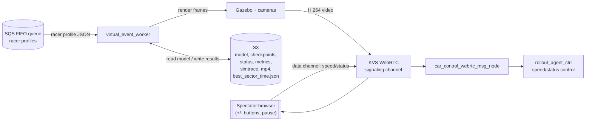
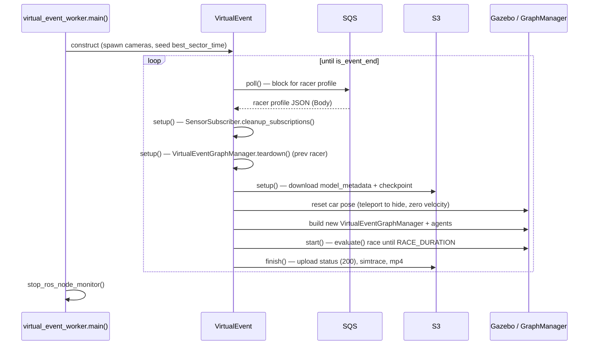
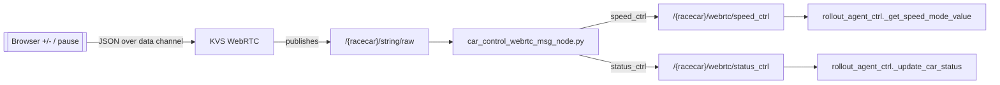
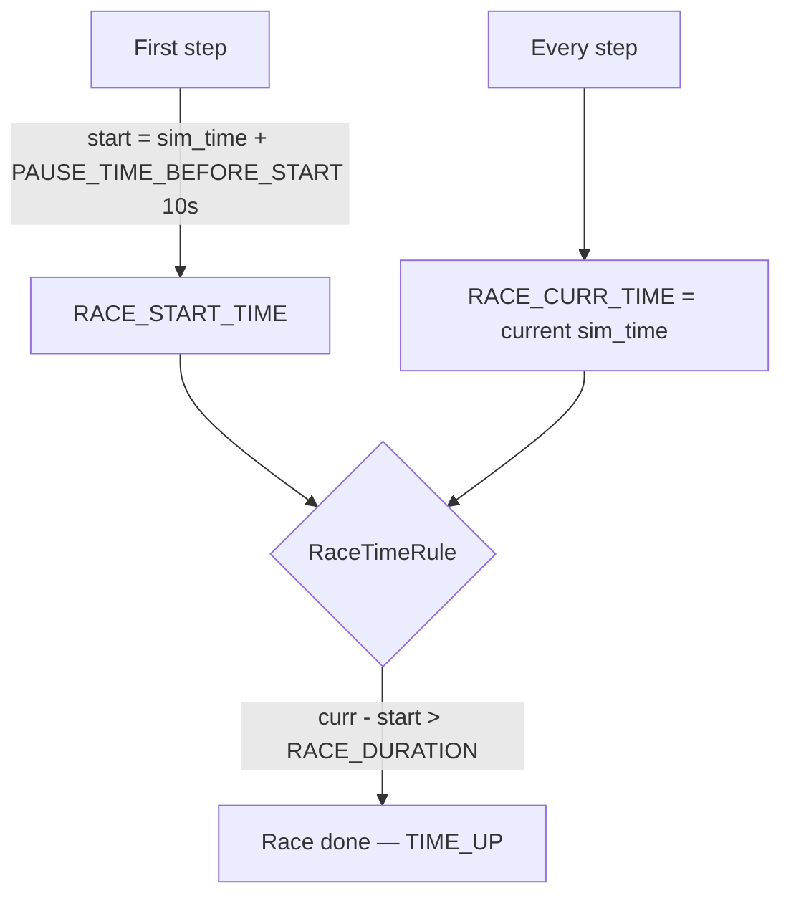
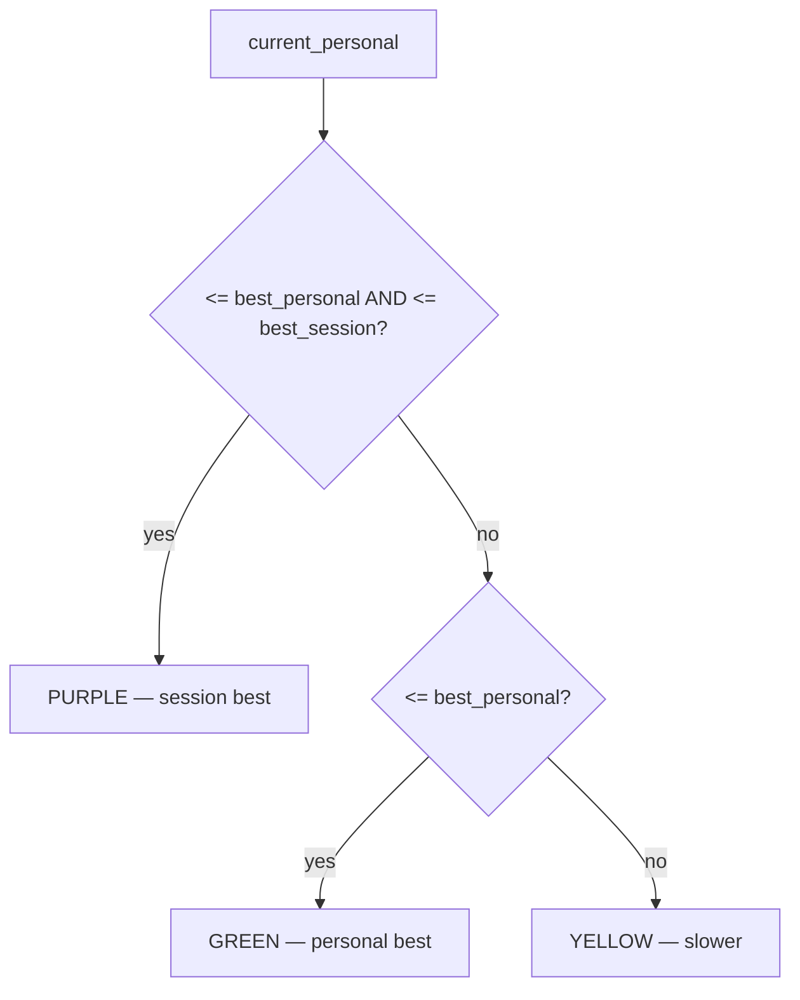

# DeepRacer SimApp — Virtual Racing Capability

A technical description of the Virtual Event (Virtual Racing) feature in `deepracer-simapp`:
its architecture, AWS dependencies, message contracts, live car control,
timekeeping / per-sector "best" logic, and per-racer resource management.

---

## 1. Overview

The Virtual Event worker is a **long-lived race host**. It runs inside the
`deepracer-simapp` container (ROS 2 Jazzy + Gazebo + Xvfb), waits for racer
profiles on an **SQS** queue, runs one evaluation race per message, streams live
video over **Kinesis Video Streams (KVS) WebRTC**, and writes results
(status, metrics, simtrace, MP4) to **S3**.

**Entry point:** `bundle/markov/virtual_event_worker.py` → `VirtualEvent`
(`bundle/markov/virtual_event/virtual_event.py`).



---

## 2. Execution flow

The worker loops forever: poll → setup → start → finish.



Key files:
- `bundle/markov/virtual_event_worker.py` — the loop.
- `bundle/markov/virtual_event/virtual_event.py` — `poll/setup/start/finish`.
- `bundle/markov/virtual_event/virtual_event_agent_data.py` — SQS + S3 model download.
- `bundle/markov/virtual_event/virtual_event_race_data.py` — race params from YAML.
- `bundle/markov/virtual_event/virtual_event_agent_model.py` — Gazebo car model (spawn/reset/delete).
- `bundle/markov/virtual_event/virtual_event_graph_manager.py` — wraps rl_coach graph manager; holds per-racer agent list.

**Launch chain** (how the worker is started):

```
sagemaker_bootstrap.py (SIMULATION_LAUNCH_FILE=virtual_event.launch.py)
  → sageonly_evals.sh  (ros2 launch …)
    → virtual_event.launch.py
      → download_params_and_roslaunch_agent.py  (fetch YAML from S3)
        → virtual_event_rl_agent.launch.py
          → virtual_event_racetrack_with_kvs.launch.py  (Gazebo + KVS + video editor)
          → run_virtual_event_rl_agent.sh  (the agent / worker)
```

---

## 3. Per-racer resource management

The worker is **long-lived**: all ROS 2 nodes and singletons persist for the
entire event. Each racer reuses the same process, so resources created per
racer must be explicitly cleaned up at the start of `setup()` before new ones
are created.

### 3.1 Gazebo car model — keep in place

Rather than deleting and respawning the Gazebo model between racers (which
takes ~3 s and triggers entity lifecycle overhead), `VirtualEventAgentModel.reset()`
teleports the car to a hidden off-track position with zero velocity using
`set_model_pose(is_blocking=True)` and refreshes the visual. The delete+respawn
path is preserved but commented out in `virtual_event.py`.

### 3.2 Sensor subscription accumulation (fixed)

`SensorSubscriber` creates ROS 2 subscriptions for camera and lidar on a
**shared single-threaded executor node** (`_node_manager`). Without cleanup,
every racer adds N new callbacks to the same executor — after K racers the
executor runs K×N callbacks per image, starving the current racer.

**Fix:** `SensorSubscriber._tracked_subscriptions` is a class-level registry.
Every `create_subscription` call registers the handle. At the start of `setup()`,
`SensorSubscriber.cleanup_subscriptions()` destroys all tracked subscriptions
and resets the registry.

### 3.3 Tracker / observer accumulation (fixed)

Three additional accumulators existed:

| Resource | Accumulation mechanism | Fix |
|----------|------------------------|-----|
| `TrackerManager` | `AbstractTracker.__init__` auto-registers every `RolloutCtrl`, `BotCarsCtrl`, `ObstaclesCtrl`; they were never removed. After K racers the tracker update loop iterates K×N objects per clock tick. | `AbstractTracker.teardown()` calls `TrackerManager.get_instance().remove(self)`. |
| `RunPhaseSubject` | `RolloutCtrl.__init__` calls `run_phase_sink.register(self)`. The subject is reused across racers, so dead observers pile up. | `RolloutCtrl.teardown()` calls `run_phase_sink.unregister(self)`. |
| `RolloutCtrl._rollout_ctrl_node` | Virtual events create 2 WEBRTC subscriptions per racer on the class-level node. After K racers, K duplicate callbacks fire for every message. | Subscriptions stored on `self` (`_webrtc_speed_sub`, `_webrtc_status_sub`); `teardown()` destroys them. |

**Teardown chain:**  
`virtual_event.py setup()` → `VirtualEventGraphManager.teardown()` → iterates
`self._agent_list` → calls `agent.ctrl.teardown()` on each agent's ctrl
(`RolloutCtrl`, `BotCarsCtrl`, `ObstaclesCtrl`) → base `AbstractTracker.teardown()`.

### 3.4 Camera flags

`CAMERA_MAIN_ENABLE` and `CAMERA_SUB_ENABLE` (from `DR_CAMERA_MAIN_ENABLE` /
`DR_CAMERA_SUB_ENABLE` in the environment) are now written into the virtual
event YAML by `scripts/virtual/prepare-config.py` and read in
`VirtualEvent.__init__`:

- `CAMERA_MAIN_ENABLE=False` → skip spawning `VirtualEventAgentCameraModel` (follow cameras)
- `CAMERA_SUB_ENABLE=False` → skip spawning `VirtualEventTopCameraModel` (overhead/sub camera)

Defaults remain `True`.

---

## 4. AWS dependencies

| Component | Used for | Required? |
|-----------|----------|-----------|
| **SQS** (`SQS_QUEUE_URL`) | Poll next racer profile(s). Drives the worker loop. | **Yes** |
| **S3** | Model metadata + checkpoints, race status, metrics, simtrace, MP4, `best_sector_time.json` | **Yes** |
| **KVS WebRTC** (`KINESIS_WEBRTC_SIGNALING_CHANNEL_NAME`) | Live video out + inbound car-control data channel | For live view / buttons |
| **KVS** (`KINESIS_VIDEO_STREAM_NAME`) | Video stream | Optional |
| **CloudWatch** | Heartbeat metrics | Optional |
| **IAM** | Credentials via `refreshed_session` | Yes |

> The current worker **cannot run without SQS and S3** — they are hard
> dependencies of the loop. KVS/CloudWatch are optional.

---

## 5. SQS message format

The worker reads the SQS message **Body** as a JSON string and validates it
against a schema (`bundle/markov/virtual_event/virtual_event_json_schema.py`).
Two contracts are accepted — a **single object** or an **array of 1–2 racers**
(head-to-head). The parser chooses based on whether the string starts with `[`.

**Single racer:**
```json
{
  "racerAlias": "MyRacer",
  "carConfig": { "carColor": "Blue", "bodyShellType": "deepracer" },
  "inputModel":    { "s3BucketName": "bucket", "s3KeyPrefix": "model/prefix", "s3KmsKeyArn": "optional" },
  "outputMetrics": { "s3BucketName": "bucket", "s3KeyPrefix": "metrics/prefix" },
  "outputStatus":  { "s3BucketName": "bucket", "s3KeyPrefix": "status/prefix" },
  "outputSimTrace":{ "s3BucketName": "bucket", "s3KeyPrefix": "simtrace/prefix" },
  "outputMp4":     { "s3BucketName": "bucket", "s3KeyPrefix": "mp4/prefix" }
}
```

**Multi-racer:** the same object wrapped in `[ ... ]` (min 1, max 2).

Schema rules:
- **Required:** `racerAlias`, `inputModel`, `outputMetrics`, `outputStatus`, `outputSimTrace`, `outputMp4`.
- Each `inputModel` / `output*` requires `s3BucketName` + `s3KeyPrefix`; `s3KmsKeyArn` optional.
- `carConfig` (`carColor`, `bodyShellType`) optional.
- Queue is **FIFO**; messages are deleted after read.
- Profiles are parsed into a `Struct`; nested **lists** inside a racer object are rejected.

> **Race settings are NOT in the SQS message.** Track, race type, duration,
> penalties, trials, sectors, and KVS channel names come from the **YAML config**.

---

## 6. Live car control — the "+/- buttons"

The +/- buttons are an **operator/spectator speed control** sent live from the
browser over the KVS WebRTC **data channel**.



**Speed modes** (`CarControlMode` in `virtual_event/constants.py`):

| Mode | Effect |
|------|--------|
| `abs` | Override model speed with an absolute m/s value |
| `multiplier` | Multiply model speed (e.g. 1.5×) |
| `percent_max` | Fraction of max speed |
| `offset` | **Add/subtract** m/s — this is the +/- buttons |
| `model_speed` | **Default** — use the trained model's speed |

**Status control** (`CarControlStatus`): `pause` / `resume`.

**With vs. without the buttons:**
- The control subscriptions only activate when `_is_virtual_event` is true.
- If **no** control message arrives, the car defaults to `model_speed` + `resume`.
- To run **without** buttons: simply don't wire the KVS data channel / send no
  messages — **no code change required**.
- To drive them **outside AWS**: publish directly to `/{racecar}/webrtc/speed_ctrl`
  (bypassing KVS).

Tampering is handled gracefully: unknown speed/status values fall back to
`model_speed` / `resume` and log an error rather than crashing the race.

---

## 7. Timekeeping

Timing is based on the **simulation clock**, not wall-clock.



- Start/current times are written to the agent status dict each step
  (`RaceCtrlStatus.RACE_START_TIME` / `RACE_CURR_TIME`).
- `RaceTimeRule` (`bundle/markov/reset/rules/race_time_rule.py`) ends the race
  when `current - start > RACE_DURATION` (default 180s).
- The displayed/recorded race time is `total_evaluation_time` (milliseconds),
  surfaced into the MP4 overlay along with `current_lap`, `reset_counter`,
  `speed`, `progress`, and per-lap `current_lap_time`.

---

## 8. Per-sector "best" logic

The track is split into **N sectors** (`NUM_SECTORS`, default 3). Three tiers
are tracked (`TrackSectorTime` in `bundle/markov/boto/s3/constants.py`):

| Tier | Meaning | Scope |
|------|---------|-------|
| `BEST_SESSION` | Fastest sector time across **all racers** | Shared (persisted to S3) |
| `BEST_PERSONAL` | This racer's best for the sector | Per racer |
| `CURRENT_PERSONAL` | The lap just completed | Per racer / lap |

**Persistence & lifecycle:**
- Stored as `best_sector_time.json` in S3 (under `YAML_S3_BUCKET`/`YAML_S3_PREFIX`)
  via `virtual_event_best_sector_time.py`.
- At startup, `VirtualEvent._persist_initial_sector_time()` seeds the file with
  `inf` per sector **if missing** (also lets a restarted job recover prior bests).
- At each racer start, the video editor downloads `BEST_SESSION`; `BEST_PERSONAL`
  and `CURRENT_PERSONAL` start at `inf`.
- If the S3 download fails, sector times become `None` and **no sector color is
  drawn** (graceful degradation).

**Color rule** (`get_sector_color` in `mp4_saving/utils.py`):



The new session best is written back to S3 in the finish state
(`mp4_saving/states/virtual_event_finish_state.py`) so the next racer sees it.

> **Caveat:** the sector-best feature lives in the **MP4 / video overlay** path
> and depends on S3. Disabling video removes the visual overlay, but the core
> race timer (`total_evaluation_time`, `RACE_DURATION`) is independent and still
> works. The unrelated `observation_sector_discretize_filter.py` /
> `DiscretizedSectorLidarDefaults` refer to **LIDAR angular sectors**, not lap timing.

---

## 9. Running on EC2 (summary)

**Provision:** FIFO SQS queue, S3 bucket(s) with the race YAML + model artifacts +
output prefixes, optional KVS WebRTC channel, and an IAM role granting
`sqs:ReceiveMessage/DeleteMessage`, `s3:GetObject/PutObject`, optional
`kinesisvideo:*` and CloudWatch.

**Required env vars** (consumed in `sagemaker_bootstrap.py`):
`SIMULATION_LAUNCH_FILE=virtual_event.launch.py`, `APP_REGION`,
`YAML_S3_BUCKET`, `YAML_S3_PREFIX`, `S3_YAML_NAME`,
`KINESIS_VIDEO_STREAM_NAME`, `WORLD_NAME`, `S3_ROS_LOG_BUCKET`,
`JOB_NAME`, `CRASH_STATUS_FILE_NAME`, plus AWS credentials (instance role preferred).

**YAML config** must include race params read via `WorldConfig.get_param`:
`SQS_QUEUE_URL`, `AWS_REGION`, `RACE_TYPE`, `RACE_DURATION`, `NUMBER_OF_TRIALS`,
`NUMBER_OF_RESETS`, penalties, `KINESIS_WEBRTC_SIGNALING_CHANNEL_NAME`,
`NUM_SECTORS`, `START_POS_OFFSET`, `CAMERA_MAIN_ENABLE`, `CAMERA_SUB_ENABLE`, …

**Operate:** start the container; the worker blocks on SQS until a racer profile
is pushed. Set `publish_to_kinesis_stream=false` to skip KVS video.

**Local without AWS:** requires code changes — point S3 clients at MinIO and
replace the SQS poll with a local injector. For lower-friction local racing,
use the standard `evaluation.launch.py` path (S3/MinIO only, no SQS/KVS).

---

## 10. Video editor

The `virtual_event_video_editor` process is launched by
`virtual_event_racetrack_with_kvs.launch.py` (one node per car). It is a
**separate process** from the `agents_video_editor` (the latter is disabled
for virtual events via `enable_agent_video_editor=false`).

**Metrics delivery (subscription, not service call):**  
Metrics were previously fetched by calling the `/{agent}/mp4_video_metrics`
ROS 2 service on every camera frame — a blocking call that held up the camera
pipeline under load. They are now delivered via a subscription to
`/{agent}/video_metrics` (`VideoMetrics` msg), published by `MarkovVideoMetrics`
(`s3_metrics.py`) on every sim step. The `_update_racers_metrics` method is
now a no-op stub.

**Callback group isolation:**  
The `MultiThreadedExecutor` spins both `VirtualEventVideoEditor` and its
`SaveToMp4` child node. Without callback group separation the high-frequency
camera subscription starved the `subscribe_to_save_mp4` service callback.
Fix: services use a shared `MutuallyExclusiveCallbackGroup`; the camera
subscription uses its own `MutuallyExclusiveCallbackGroup`.

---

## 11. Key files reference

| Concern | File |
|---------|------|
| Worker loop | `bundle/markov/virtual_event_worker.py` |
| Race orchestration | `bundle/markov/virtual_event/virtual_event.py` |
| SQS + model download | `bundle/markov/virtual_event/virtual_event_agent_data.py` |
| Race params (YAML) | `bundle/markov/virtual_event/virtual_event_race_data.py` |
| SQS schemas | `bundle/markov/virtual_event/virtual_event_json_schema.py` |
| Gazebo car model | `bundle/markov/virtual_event/virtual_event_agent_model.py` |
| Graph manager (per racer) | `bundle/markov/virtual_event/virtual_event_graph_manager.py` |
| Sensor subscription cleanup | `bundle/markov/sensors/sensors_rollout.py` (`SensorSubscriber`) |
| Tracker base + teardown | `bundle/markov/gazebo_tracker/abs_tracker.py` |
| Per-racer ctrl teardown | `bundle/markov/agent_ctrl/rollout_agent_ctrl.py` |
| Car-control constants | `bundle/markov/virtual_event/constants.py` |
| Car-control bridge | `bundle/src/deepracer_simulation_environment/scripts/car_control_webrtc_msg_node.py` |
| Speed/status handling | `bundle/markov/agent_ctrl/rollout_agent_ctrl.py` |
| Race-time rule | `bundle/markov/reset/rules/race_time_rule.py` |
| Best sector time (S3) | `bundle/markov/boto/s3/files/virtual_event_best_sector_time.py` |
| Sector color logic | `bundle/src/deepracer_simulation_environment/scripts/mp4_saving/utils.py` |
| Video editor | `bundle/src/deepracer_simulation_environment/scripts/mp4_saving/virtual_event_video_editor.py` |
| Video overlay | `bundle/src/deepracer_simulation_environment/scripts/mp4_saving/virtual_event_single_agent_image_editing.py` |
| Virtual event YAML builder | `scripts/virtual/prepare-config.py` |
| Launch entry | `bundle/src/deepracer_simulation_environment/launch/virtual_event.launch.py` |
| Bootstrap env | `docker/files/ml-code/sagemaker_bootstrap.py` |